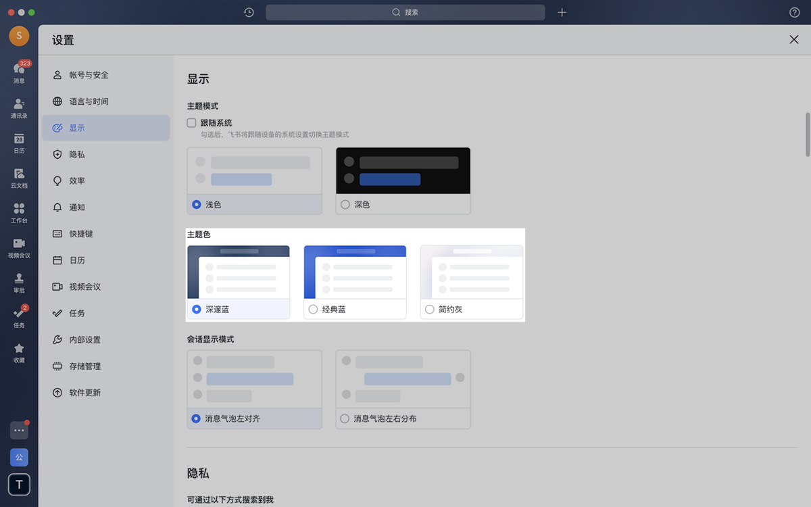
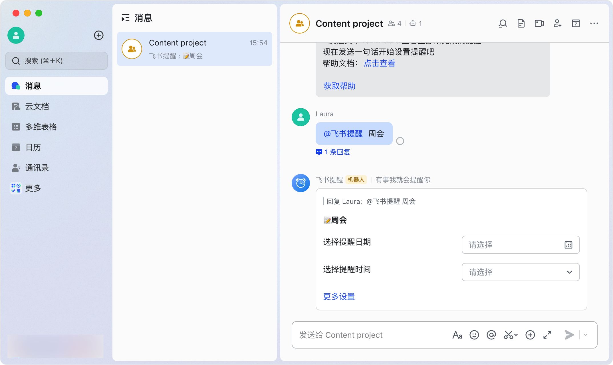
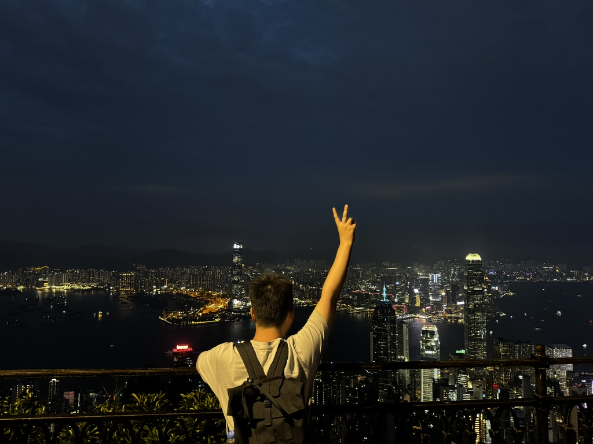
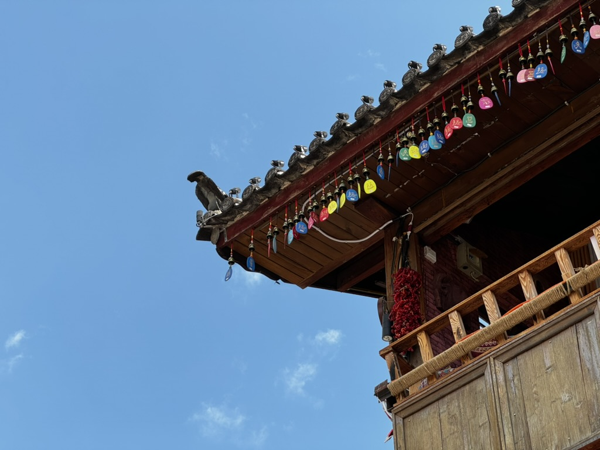
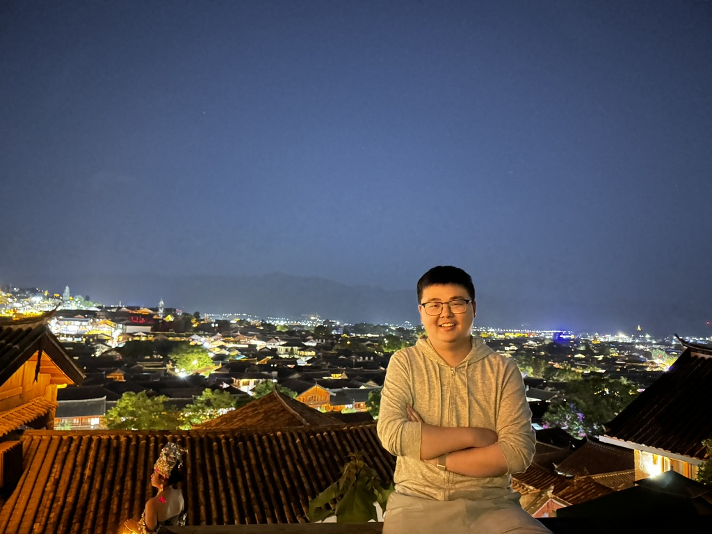
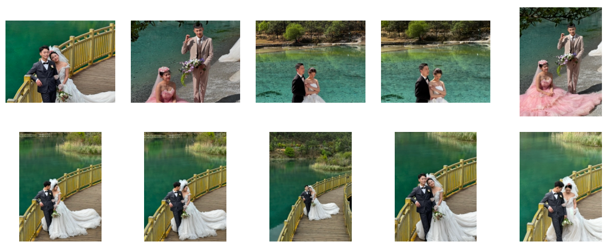
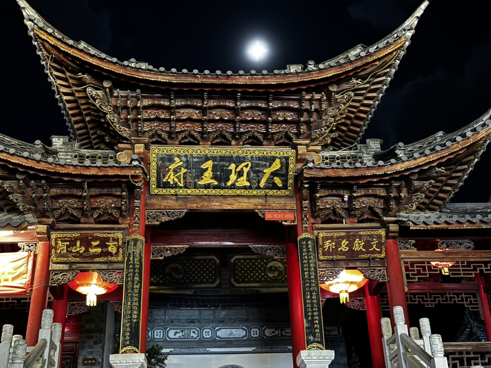

## head 

时间过的真快 转个圈 一年又这样过去了  

这应该是这么多年来 第一篇算得上是有意义年终总结（流水账）吧，有了域名 不搭建个博客 总感觉缺了点什么  每次看见别人的文章，舒服中带一点柔软，而我，小学时候只会写记叙文；中学只会写议论文；大学的论文都是集百家之长，像是犬夜叉-- 到处收集四魂之玉碎片；后面工作了两年，写过的只有技术文档、汇报文档、复盘文档， 除了写清楚工作内容和技术细节 还要装模作样的充满各种难道晦涩的黑话。终于！今天可以随心所欲地瞎写一通了！

<!--more-->

## work

今年的工作可以说是相当不顺了，可以说是上了年轻人的第一课 **裁员** 

飞书 CEO 谢欣在 3月26日发布了全员信

> 经过几年时间的共同努力和持续创新，我们的业务取得了一定的突破，不仅有了各行各业的大大小小的客户，品牌知名度也在持续提升，并在 to B 领域成为了用户广泛喜爱的品牌。但与此同时，我们也发现了组织自身存在的问题：团队规模比较大，但组织不够精干，大家也感受到效率在变低，力量不够聚焦，这不利于业务的长期发展。
>
> 经过反复多次的讨论和非常慎重的抉择，我们决定做一些调整，会适当精简团队规模。非常遗憾，有部分同学会因此不得不离开我们。同时，我们也会为受到影响的同学提供补偿方案或转岗机会的支持，帮助平稳过渡。
>
> 这一次调整，不仅是团队规模的调整，更重要的是要重新回到初创公司的 day 1 状态——方向更聚焦、组织更高效，团队也要更有战斗力。
>
> 更精益的组织，会增强业务可持续性，从而加强对客户的长期保障。我们也深知，只有持续的、高质量的投入，才能做好我们的 to B 业务，并服务好更广大的客户。
>
> 我在这里想感谢每一位同学，是因为你们的努力，才有了飞书的发展。这是我们部门第一次做出这样的调整，今天是艰难的一天，对于所有受影响的同学，我由衷感激你们为飞书做出的贡献，并会尽力为你们提供支持与帮助。
>
> 面向未来，我们还要持续提升产品竞争力，尤其要提升 AI 的能力，我们不仅要继续服务好已有客户和拓展新的行业、领域的客户，还要通过创新来帮助用户提升工作的效率和创造力。

当天下午 我还我的虚线上级聊完第二个季度的工作规划和任务，结果傍晚我就收到了 leader 的 1on1 会议，我顿感大事不好， 要完蛋了！

到了第二天，确实是这样，办公楼所有的会议室被约满了，规模不小，会议室里除了 leader 和 还来了一位 HRBP；全程都是 HRBP 在说一些不会留下法律漏洞的套话，Leader 只会装委屈 说抱歉，妈的 太气人了！除了签字的时候手有点抖，我内心还挺平静的，可能从我内心来说 早就不想干了吧。

说回裁员的问题，其实不是我水平和产出的问题；高层不愿意承认路线上的错误，总有一些我们这种小卡拉米来背锅：

### 从整个飞书产品上来看:

  

上面是飞书 7之前的UI， 下面是飞书7之后的 UI

	

- 搜索功能从最顶上的大入口移到了左边那么小小的一条（这还是内测版本被骂过之后的优化，最初的版本只有一个放大镜的小按钮）

- 想做 all in one : 飞书文档在飞书 app 内打开 而不是浏览器。。（收获的又是骂声一片，难道上层没有边沟通边写文档的需求吗）
- 以及各种所谓的“优化“ 却导致的app越来越卡的更新

最后结果就是谢欣在内网道歉 , 7.0版本的负责人 齐俊元 跑路到AI部门 不做飞书了。 笑

### 从大部门产品来看

整个大部门之前来了个产品头头，水平不知，来了就开始推所谓的1p=3p， 一方应用=三方应用的项目开发。用人话说就是：客户自己的产品要接入飞书开放api是要经过严格鉴权的，而飞书内部的开发是不用的；现在主推飞书内部间的接口调用也需要鉴权， 结果弄得一地鸡毛， 链路变长、功能退化、性能受损、上游不接、浪费人力、几次放量都失败。

实际上这玩意就是违背客观规律的，第三方应用接入api的鉴权主要是作为人的角度的，比如以我的登录状态（我的权限），我可以获取到你的信息、以他的登录状态，就不能获取到他的信息；微服务间的调用鉴权，主要是看你是不是那个服务，比如上游是邮件服务--你是邮件服务，你当然有权限拿到电子邮件这一类的数据，至于什么人的邮件数据不能给客户，这应该是你邮件服务做的，我管不着；数据泄露了也是邮件服务的事。 

但是这个所谓的 1p=3p 到最后就变成了 邮件服务告诉基础服务，主体是谁谁谁 他要谁谁的电子邮件，他能看哪些人的电子邮件；你基础服务看着办吧；权限规则，鉴权，如果是海外的还要加上跨洋；有一些还有特化的逻辑，加在一起不超时就怪了；能满足需求就怪了。

"你这个踢球的理念你就没搞懂，他能踢好球吗？ 我奉劝你们，先把这个踢球的理念搞懂来" --范志毅

该产品头头在2月突然离职。 笑

### 从整个小部门来看

没办法的，毕竟是从其他部门合并进来的，又做的是上面的💩项目，试验品，实验还失败了，高层又有裁员任务下来，又过了新手保护期，又换了leader ，和leader不熟， leader 想安排嫡系进来，不是你挨刀那还能是谁。

说回谢欣说的`团队规模比较大，但组织不够精干，大家也感受到效率在变低，力量不够聚焦，这不利于业务的长期发展` 

个人感受 即使那么多人，活依然干不完， 真的有那么多活吗？ 我想是的，但是一半的活来自高层产品的自我陶醉和点子，一半的活来自基层产品为满足大客户的需求而接下的活。 saas真不好做，特别是企业软件，每一个企业的需求都不一样，销售为了销量和市场占有率，什么功能都答应，什么都说能做，客户下了订单之后，产品就成了传话筒，客户要什么功能，产品就画什么功能的原型图；一年到头都做不完。有时候 ，字节高层有一些有急又麻烦的需求，而且又没有普适性，特恶心；我之前就给 yiming 和 rubo 做过一个需求，做的时候需求不说清楚， 啃哧啃吃干了一个月，做完验收的时候 rubo-1的 pmo 说不行，周末连续干了两天。

**力量不够聚焦，是因为高层的目标不够聚焦；之所以有平庸的重力，是因为高层太过于平庸；裁员，就是高层面对决策失败给 yiming 最好的交代方法**。

## life

离职之后，带着偶尔焦虑的心情出去转了转，首站去了香港🇭🇰 

### hongkong

在没去香港之前，国内的新闻说二维码是领先的支付方式，国（境）外没有流行起来时因为他们太落后了， 跟不上时代。 我还是比较认可这种说法的； 直到在香港体验了两天 apple pay + 八达通之后，才知道什么是真正的现代支付方式； 快节奏的支付才能与快节奏的生活方式契合；

之前常听到有内地游客在香港收到歧视的新闻，不排除的确有个别情况；但我觉得大部分还是因为生活节奏的不同导致的；就拿乘坐公交车来说，香港路窄车多，公交车上下车速度快，上车基本都是刷八达通，手机贴过气就行，脚步👣基本不用停；在内地，公交车基本就是刷二维码；先不说二维码因为环境光强度 屏幕亮度导致经常刷不上的情况，一半一半的的人都是先上车->堵着->解锁手机->打开支付宝-> 支付宝加载个几秒-> 刷码 识别如果不灵敏，还得再刷一次。 这种效率放在香港那种哪条路的车水马龙的主干道，司机不吼你才怪！（没有说内地刷二维码不好的意思， 只是说段位不匹配）

希望内地也早点脱离自嗨环境 跟上时代潮流 早点普及NFC支付吧，让每个人都能享受科技的乐趣。

其他就没什么了， 维多利亚港和太平山 十几年前就去过，但再次看还是觉得很震撼

 一个路人小姐姐

### 云南

云南到了丽江和大理

#### 丽江古城

纯纯商业古城，里面全是后面进来的商人，原住民早就搬出去了，酒吧（酒馆）、写真店、民宿、各种宰人的花茶、咖啡、玫瑰花饼店；只适合热恋中的小情侣来拍写真；除了湛蓝的天空 和 晚上在狮子山（好像是叫这个） 俯瞰的夜景，其他的我都觉得一般，没什么吸引力 商业化太严重了，里面的商人都心怀鬼胎 充满着欺诈消费（暴论）

#### 玉龙雪山

去的时候是春夏之交，刚好去的前几天山顶还下了一场大雪，运气挺不错的； 看到一小会儿日照金山， 山顶上反而觉得不是很惊艳算是正常发吧，爬山没缺氧，倒是下山的时候下降速度太快醉氧了，直接昏死过去（

一些拍婚纱照的新人，希望他们百年好合

### 大理

其实云南我最想去的就是大理了，我想每一个仙剑迷应该对南诏国都有一种的特别的滤镜，但是很遗憾，大理待了那么几天，没有找到 印象滤镜中南诏古国的样子，听说南诏国的发源地在离大理几十公里外的巍山，那里的古城没有什么商业化，都是原住民，保留着原本的味道，下次一定去！

时间来不及了 复制图片太麻烦了 就这样吧

## friends

今年见了很多很久没见到的朋友 但是很遗憾没留下什么合照（仅有的一些发出来也不太好），感觉时间都被偷走了，下次见面一定合照，定格住那一刻的见面

- 3月份听说我要离职后，阿亮来杭州陪我玩了两天，一起看了脱口秀；第一次线下看，还挺有意思的，特地坐的前两排，但是没有准备好梗，准备好了就更好玩了，主持人水平不错 几次都callback了，下一次比较想去看二狗一只麦
- 5月和exqlnet 一起去了香港-成都-丽江-大理-长沙 他主要是骗我陪他去成都， 故地重游，解开心结；在成都夜晚的街头喝个大醉，见到了成都的特产--gay（真的太震惊了，数量多的我震撼一整年），好在两顿酒没白喝，看样子是成功了
- 后面在家和 sher 喝了一次咖啡，和我一样 在家待业组hhh 她有自己的想法也很独立，有自己想要做的事情，不知道是否会偶尔焦虑和低落；和她聊天总感觉有些距离始终靠近不了，让我有些不知所措； 不过真心希望她一切都好。
- 9月去南昌看了许嵩的演唱会，童年终于完整了，那些在被窝拿着功能机偷偷听许嵩的日子；体验了下 小尹的特斯拉，不过在学校里面被学生追尾了，sad
- 后面因为xinzhi的一些事情，我和exqlnet去广州看望了一下她，顺便去南澳感受了下海风；希望过去的悲伤事情像是写在沙滩上的小子 被海浪轻轻抹平
- 在广州还特地还和星星见了一面，高中的时候我总是儿媳儿媳的喊她，才知道她和我的“儿子” 没有谈过恋爱， 天塌了，原来我一直在网暴，还好友谊的小船没有翻掉
- 年底去上海看了 major ，见到了多年未见的学长 southstone ，想起大一的时候 第一个linux系统就是他帮我装的 ，也一直带我打cs 没想到6年那么快就过了，终于理解那些喜欢足球的人了；就像我喜欢反恐精英一样 这就是竞技的魅力，每一个人都有不能输的理由，但是奖杯只有一个

## tail

时间差不多了，天都黑了，也写不动了，打字真是件麻烦的事情，  我要去三江公园看看有没有孔明灯和烟花了

2025希望大家都能被爱与快乐包围🎉

> 头图生成： ChatGPT ， 帮我生成一张元旦江滩跨年绚丽烟花的横幅图片，不需要很多人 构图主体有几个人 ，江滩，烟花 就行

<u>于水南街星巴克</u>

