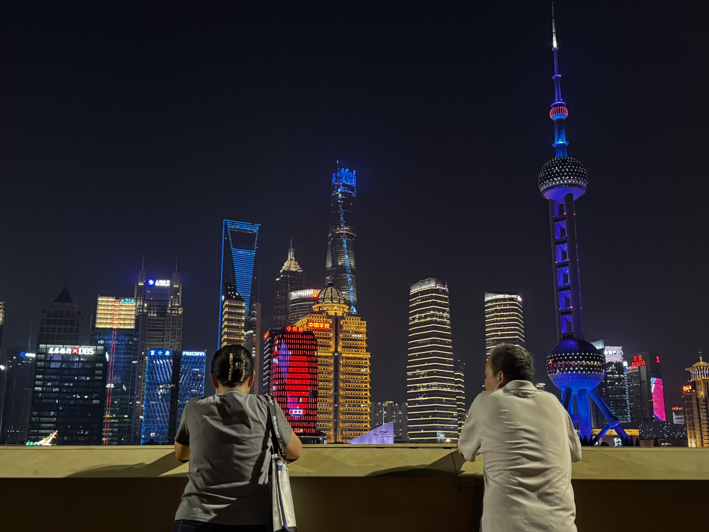
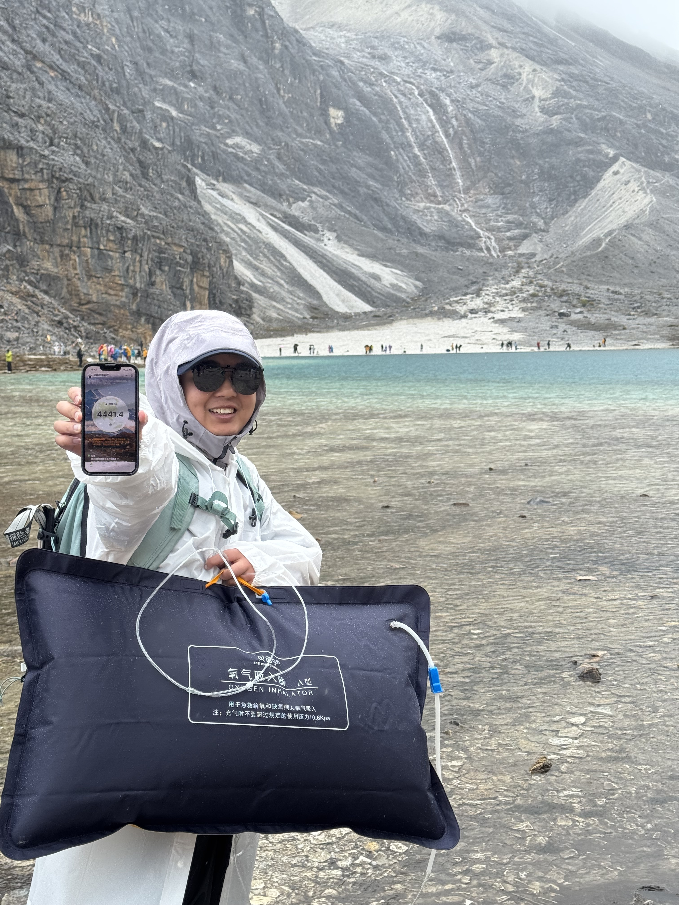
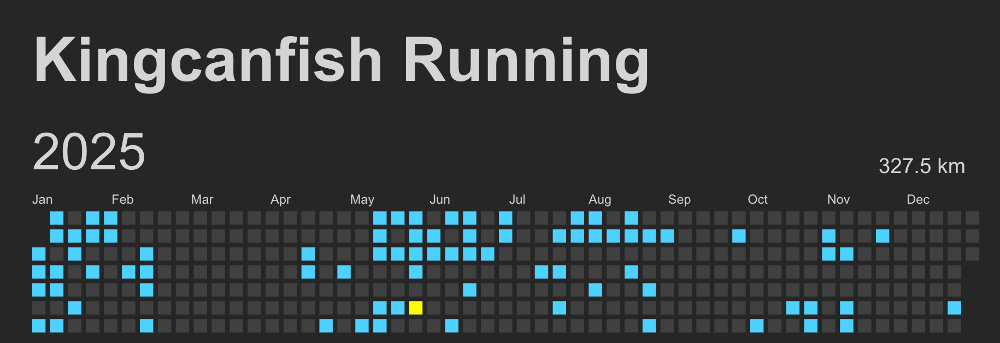

# 2025 年度回顾：缝隙中的光与尘

一晃眼，这一年又过去了。敲击键盘写下“2025”的时候，仿佛 2024 就在昨天。坐在电脑前，感觉胸腔里积攒了无数话语，到了嘴边却又不知从何说起。

## 生活：归途与重聚

今年，我回到了杭州，也结束了自己人生中第一次 Gap Year。

搬家从三墩到了五常，离之前工作生活的地方并不远。回想以前，住所和办公楼就在同一个园区，工作日仿佛是在地下车库和写字楼之间两点一线的折返跑。那时候觉得自己像极了楼宇间的一只“鼠鼠”，一个工作日都见不到几次太阳。

今年住得离公司稍远了些，通勤单程需要半小时，但这反而让我觉得是一种难以言喻的“好”。这半小时，是我每天唯一能确凿见到阳光的时刻。人啊，只要每天能晒到一点太阳，不说心情舒畅一整天吧，至少能换得几个小时的内心平和。况且我喜欢热闹，早高峰那熙熙攘攘的人潮，在我眼里也是一种别样的生机（虽然可能只有我这么觉得）。

**春节与求职**
2025 年的第一个季度，重心全在过年和找工作上。过年前忙于筹备，过年后便马不停蹄地投身于海投。那段时间，我把自己关在房间里，终日面对着八股文和算法题，焦虑着下一场的面试。现在回想，那段时间仿佛被偷走了，投入了巨大的精力，却在水面没激起什么水花。

**家庭的变数与团圆**
这几年医疗财政吃紧，受各种因素影响，父亲所在的县城医院甚至穷到只能给副高医师开几千块的工资。父亲是个老实人，从上班起就没换过单位，但人一旦太老实，似乎就容易受欺负。到了今年，工资不仅被压，甚至不如进厂打工，这对一位副高职称的医生来说，无疑是一种羞辱。好在他在 2024 年底于上海嘉定找到了一份新工作。但这把年纪还要在外打拼，说实话，我心里挺愧疚的。至于当下的医疗行业政策，我只能叹口气——哎。

正因如此，在准备回杭州入职时，我决定把已经退休的母亲带上。一来，一家三口分居三地不仅小家破碎，更无法相互照顾；二来，父亲那边单位虽分了单间，但若有室友同住终归不便。索性让母亲跟着我，也省去了我天天点外卖的烦恼。

**杭州的新日常**
安顿下来后，平日我上班，母亲便在家追剧，闲暇时去附近的菜市场逛逛。一般到了周末，父亲会从上海赶来，我们一家三口就在杭州城里闲逛。一年下来，杭州能去的地方基本都踏遍了。实在无处可去时，我们便想着明年往周边探索一下，周末租辆车，去湖州、安吉、绍兴转转，一来练练手，二来也算是个短途旅行。

## 旅途：山海与信仰

**川西：反穿大环线**
下半年趁着国庆假期，我和 exqlnet、jinof、southstone 以及他的女朋友 limi，自驾踏上了川西反穿大环线的旅程。路线从成都出发，经康定、新都桥、鱼子西、理塘、稻城亚丁、新龙、甘孜、炉霍、丹巴、小金，最后经四姑娘山回到成都。

总体行程非常顺利，唯一的遗憾是在亚丁那几天天气不佳，小雨起雾，阴沉沉的。或许是十月初去得太早，草地未黄，雪山无雪，景色稍稍差了点意思。那里是一个“缺氧但不缺信仰”的地方，藏传佛教信徒的虔诚确实比汉传佛教看上去要更厚重一些。不过宗教之事，不予置评，每个人有自己的追求，我只负责记录人文见闻。

在新都桥的第一个晚上，身体给了我一点颜色瞧瞧。半夜辗转反侧，心跳加速，难以入眠，差点以为自己要“噶”在那里。后来我才得知，上高原是有“SOP”的：第一天白天上高海拔活动，晚上下到低海拔睡觉；第二天再上高一点，晚上再稍低一点，让身体有个适应的梯次。

到了理塘（文中“礼堂”应为笔误），我也没能免俗，朝圣了一下丁真，拍了个“丽丽同款”视频，画面过于抽象，我自己都不好意思点开看。

途经新龙、炉霍这几个小县城时，我感觉这地方养老简直太舒服了。小小的城区，几分钟就能从这头走到那头，慢节奏得让人心安。最后一天快速过了一下四姑娘山，感觉作为反穿的最后一站，它的震撼力远不及最先看到的鱼子西和折多山——也许，“首因效应”在风景面前也同样适用吧。

**台州：寻味与听海**
跨年前的那个周末，来了一场说走就走的特种兵式旅行。我和 ujay、zhouyingsasa 一拍即合，驱车前往台州。其实几年前我们就念叨着想吃新荣记，想去看看这唯一的米其林连锁餐厅到底有何过人之处。

第一天我们先去了水桶岙沿海绿道，那里被誉为“小香港麦理浩径”。我虽未到过麦理浩径不便比较，但就个人体验而言，风景确实不错，山的尽头就是海。唯一的缺憾是近海海水颜色偏黄，真可谓是“可远观而不可亵玩焉”。

周日如愿去吃了新荣记，点了份 598 元/位的冬至“穷鬼套餐”。说实话，这让我有点“山猪吃细糠”的惶恐。新荣记确实好吃，但我甚至不知该如何精准描述它的美味。唯独那道醉蟹，蟹膏肥美，黄酒的醇香沁人心脾，至今难忘。

跨年夜看了一场交响乐音乐会。听说乐团还有“高级团”和“水团”之分，高雅艺术的行列我也不太懂，但听着确实不错。现场还有互动环节，我也算是体验了一次“被指挥”的感觉。

## 工作：抉择与磨合

**面试众生相**
年初海投简历，作为 Gap 过一年的人，情况并没有网上描述的那般惨烈，或许和之前字节的工作经历有关。我只投听过名字且知道业务模式的科技公司，陌生的企业一律略过。

*   **上海英孚教育**：面我的是一位从腾讯出来的小姐姐，做 AI 产品相关。不加班、Base 高、年终奖厚，但我面得不太好。介绍动态用户组架构时“撞枪口”了——她在腾讯也做过类似的，当场质疑我为何不那样做。当时脑子一热，钻进死胡同想证明自己的架构更好，结果聊歪了，应该抓住场景不同点来说的。再加上全排列算法题没写出来（写成了剪枝，校招时的知识点太久没练确实生疏），遂挂。为此伤心了好几天。
*   **字节跳动**：不知被哪个部门捞了起来，体验极差。面试官似乎没认真听介绍，对项目也没兴趣，讲完就甩一道场景题。这种面试官最烦人，直接把工作中碰到的难题拿来面试。你每天工作 12 小时都想不出完美方案，我几十分钟怎么可能想出来？我想得出来，还能坐在这里被你面？互相拉黑吧。
*   **百度**：典型的 KPI 面。面试官不做准备，让我一个劲地讲，讲完就结束，全程 0 沟通。一生黑，傻哔。面试前还得做繁琐的测评文件，更傻哔了。
*   **钉钉**：和我之前在飞书的专业对口。一面聊了两个小时，深度交流“飞书怎么做、钉钉怎么做”。二面见 Leader，聊得也挺开心，但没过。个人感觉和职级有关，可能不缺我这个层级的人，只是因为对口愿意聊聊看。后来听说无招回归钉钉，那里直接变地狱模式。此时确是无招胜有招，还好没去。
*   **作业帮**：几面下来感觉这里技术实力不错，老大负责整个集团 KV 系统。无奈 HR 催着接offer、催着入职，要求下周就到岗，让人感到恐怖。再加上在武汉，公积金不给满，遂毁 offer。（小插曲：HR 得知我不去后还打来电话骂了我一顿……只能说还好没去，这都什么人啊。）
*   **英语流利说**：面试最轻松愉快。当一面面试官问的都是些大一大二水平的问题，我就知道这家公司要被我“速通”了。事实确实如此。Base 虽然看着还行，但拆成基本工资+绩效，公积金也不给满。风险大且无技术挑战，婉拒。
*   **武汉微派**：游戏公司。面试官纯纯是大聪明，让我写扑克牌游戏，角度刁钻。坐牢了一个半小时实在不会，反问他怎么写，他说他也是随便想的场景和条件……离谱。
*   **长桥 Longbridge**：一家面向港美股的海外券商新势力。面试体验较好，面了三轮技术略累，但反馈很快。前字节的同事也在，说不卷。虽然钱给少了点，但公积金全额缴纳，又在杭州。在这几家里面权衡下来，这是最合适的选择，于是接了 offer 顺利入职。

**职场现状与内外博弈**
正式上班后，确实如前同事所言，相对不卷。早上九点半上班，我一般八点前就跑了。但小而美公司和大厂相比，最难受的是基础架构太弱。全是“手动挡”，虽然有中间件支持，但用起来难受，甚至直接上跳板机操作 kubectl 比部署平台还顺手🤦‍♂️。

业务理解也是一大难点，证券行业有其特殊性。以前做的数据从生产到消费能闭环，通过你的服务写入，再从你这查询。但券商不一样，无论是行情还是交易，都要对接上游交易所，数据极其依赖外部。数据模型难以定义，且行业没有标准答案。比如公司财报、公司行动，每家上手都有微小误差；又如前复权 K 线数据，往前推几十年，各家可能都不一样。最烦的用户反馈就是：“为什么你们和富途的不一样？”很难解释，也很麻烦。

技术栈方面，接触到了之前在字节没用过的 QUIC、Parquet、ClickHouse，尤其是 Rust。以前想学 Rust 苦无练习机会，反复入门好几次，现在终于有机会实战了。这也算是一种“反向涨薪”的自我安慰：“没关系，虽然工资降了，但你学到了想学的东西。”

入职九个月，干了六个月的杂活，边干边学，算是入了证券行的门，熟悉了行情名词和逻辑。后续可能要用 `navi` 这个语言来做后实时行情的数据批处理，比如回测收益率、计算周期性统计数据等。

说起 `navi`，这是我们内部一位大佬自创的基于 Rust 的动态编译语言。至于为什么一定要用它，我觉得大概率是“政治任务”占多数——作为科技型券商，没有开源社区回馈似乎说不过去，自创一门语言能体现技术底蕴。

但说实话，用了两个月，我真的十分痛苦：
1.  **没有 LSP 或者说残缺**：只负责高亮，没有语法分析，没有代码跳转，报错全靠 run，效率极低。
2.  **没有周边生态**：聊胜于无的标准库，维护者只有那位大佬，想要什么功能必须从零开始在 Rust 上翻译。
3.  **AI 不懂 navi**：在 AI 技术爆炸的今天，AI 写不来 navi，一招打回解放前。如果用 Rust 或 Python，同样的需求在 AI 助力下可能半天搞定；但用 navi，尤其是在上述几层 debuff 下，一个星期不加班能做出来就不错了。

持悲观态度。工作嘛，挣点窝囊费。也不知道新的一年目标该怎么定，最后到底会发展成什么样。

## 事业：危机与变革

为什么要把“事业”和“工作”分开两段？我觉得事业是事业，工作是工作。虽然两者可能处于同一行业，但事业是你自己的，工作是老板的；事业是你内心渴望的追求，工作可能是你不想干的“饭碗”。

事业应该走在行业最前沿，而工作充满了各种现实因素和妥协。那些丑陋的架构、捏着鼻子写的屎山代码、不得不花大量时间应付的政治需求，工作带给你的往往是 Debuff。

这一年，人工智能技术的变革太快了！谁能想到，年初 DeepSeek R1/V3 横空出世，震惊全球；到年底 Claude Opus 4.5、GPT 5.2 写代码又快又好。从 RAG 技术到超大上下文，从 MCP 到 Claude Skill，AI 的进化是日新月异的。

年初时，AI 写的代码还漏洞百出，无法编译；年中也只能勉强编译，逻辑需手动调整；到现在已近乎“所见即所得”，甚至不用 review 代码，能跑就是成了。

我有种强烈的预感：程序员这个行业真的已经到头了。单纯面对需求“会写代码”的 level，已经彻彻底底被 AI 取代了。只要你有现成的需求，能够清晰地描述，AI 不仅写得比你快，还写得好。这你受得了吗？

所以，今年得尽快锻炼自己的产品创造能力，而不是一味地钻研框架和底层代码。大人，时代已经变了！

从更大的视角看，虽然今年人工智能发生了翻天覆地的变化，但这主要是基于 NLP 和 Transformer 技术积累后的爆发。可能之前积累到了临界点，OpenAI 刚好找到了发力口。当 AI 的发展速度超过新技术积累和变革的速度时，终究会进入一个缓慢的存量增长期。

而在这个缓慢增长期到来时，就是这项技术真正变为普适技术的时候。我想表达的是，现在的 AI 股涨得让人害怕，包括各种 AI 概念股。不知道这真的是一次真正的工业革命，还是夹杂着泡沫的垂直领域技术变革。也许几年后再回看这篇流水账，就会有答案了吧。

## 情感与寄语

哎，今年的感情（恋爱）发展又是毫无进展的、略显失败的一年呢。

**其他**
本来说 2025 年要减肥来着，从年初的 160 斤减到 9 月份的 140 斤，断断续续锻炼，效果还算凑合。但因为听说去川西高海拔前不能做剧烈运动，就停了。没想到这一停， inertia（惯性）占了上风，再也没恢复锻炼。我这个人靠意志力是不行的，得靠习惯。

明年再接再厉吧，目标 120 斤。干！